# N8N - PROJECT


## Table of Contents
* **Wat is N8N?**
* **Installatie**
* **Functionaliteiten van Cat Node**
* **Handleiding voor het gebruik van Cat Node**
* **Tests**

### **Wat is N8N?**
N8n is een automatisering tool waar jij als gebruiker workflows kan maken om het werkproces te automatiseren. Voor onze werkplaats 5 gaan we een custom Node bouwen waarmee wij iets kunnen toevoegen van waarde voor onze client, CloudShift.
### **Installatie**
Om gebruik te maken van N8N moet je het eerst installeren in jouw systeem via CMD. 
```
n8n install n8n -g
```
Om n8n lokaal te hosten op jouw client gebruik je de syntax
```
n8n start --tunnel
```
**Let op!** Je moet gebruik maken van --tunnel om gebruik te maken van HTTP Requests binnen N8N.
### **Functionaliteiten van Cat Node**
#### **Functies van de Node**
```
1. Stuur foto's van katten
2. Stuur GIF van katten
3. Stuur foto's van katten met beschrijving (met verwachte leeftijd en oorsprong)
```
#### **Beperkingen van de Node**
```
1. De Additional Fields doet niks.
2. Om toegang te krijgen tot de output van Cat moet je per se [0] achter de Json zetten. Je kunt dus niet simpelweg vanuit de input van de vorige node halen. Nou ja kan wel maar dan moet je wel elke keer [0] achter de Json zetten
3. Docs gaat nergens naartoe.
4. Je kan geen bepaalde soort katten zoeken. Het is allemaal random.
5. Er is geen optie om de lengte en hoogte van de foto's of GIFs te zetten.
```
# **Handleiding voor het gebruik van Cat Node**
#### **Maak een N8N Workflow aan**
Als je n8n start --tunnel hebt geactiveerd hebt zal je een localhost hebben met een port.       
Maak een N8N Workflow aan door de knop 'Add Workflow' te klikken.


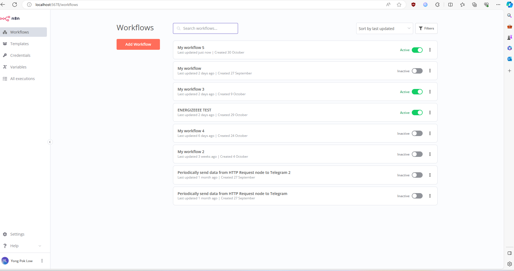

#### **Zet Telegram Trigger neer dat reageert op elke Message**
Eenmaal binnen je Workflow zie je meteen een + knop met als tekst 'Add first step...'.       
Druk erop en in de zoekbalk typ je 'Telegram'.       
Je hebt dan keuze uit 9 Triggers. Voor deze voorbeeld kiezen we 'On Message'

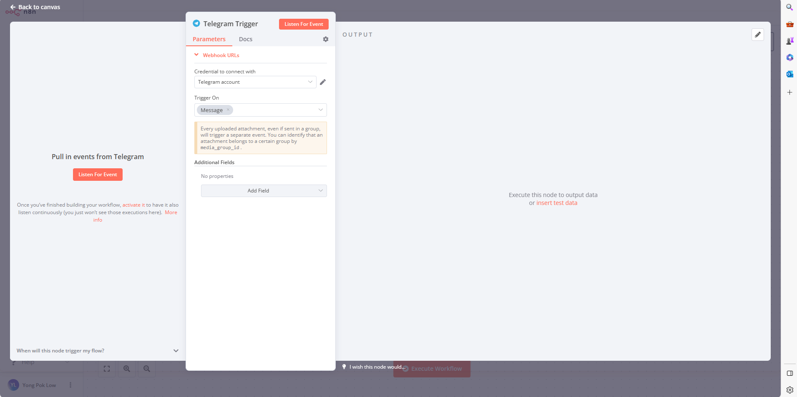

#### **Zoek Cat Node op en voer Credentials in!**
Klik op de plus knopje naast de Telegram Trigger en zoek op 'Cat'.  
Klik vervolgens op de potlood icoontje naast de 'Cat account' om de credentials in te voeren.

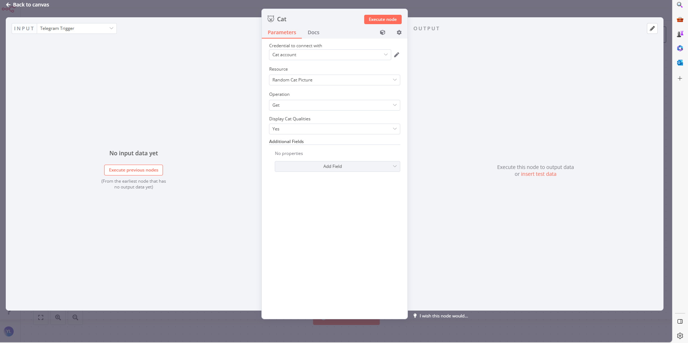

#### **Vul de API Key in om toegang te krijgen tot de Cat API.**                 
``` 
live_rTcHLiRJhVBwWzluR6il6QLmjQ0640BMOzomWz5mb3EQ7NQFJYxyxtIvcdUB5RMG
```

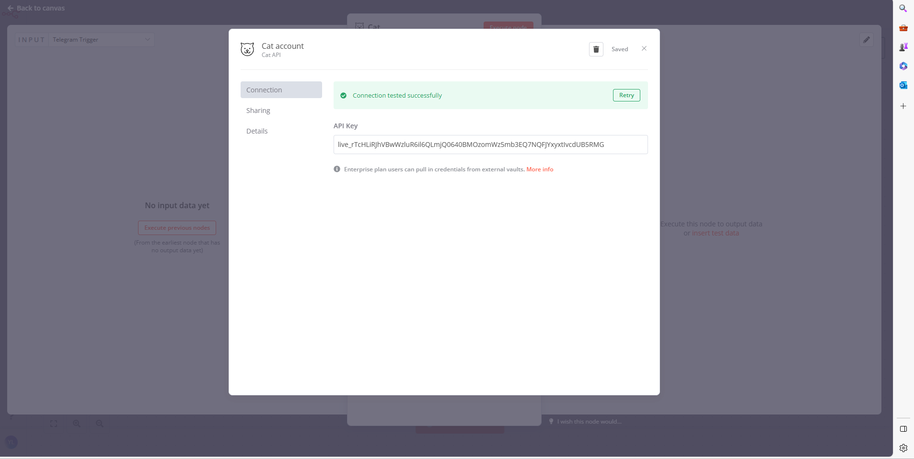

#### *Maak een keuze bij de Resource tussen Random Cat Picture of Random Cat GIFS*
De Cat NODE heeft 2 keuzes bij de Resources.
* *Random Cat Picture*
* *Random Cat GIFS*      

Bij allebei laat je de Operation op standaard 'Get'.        
Display Cat Qualities kan je een keuze maken tussen 'Yes' of 'No'. De Display Cat Qualities is alleen toepasbaar bij *Random Cat Picture!*

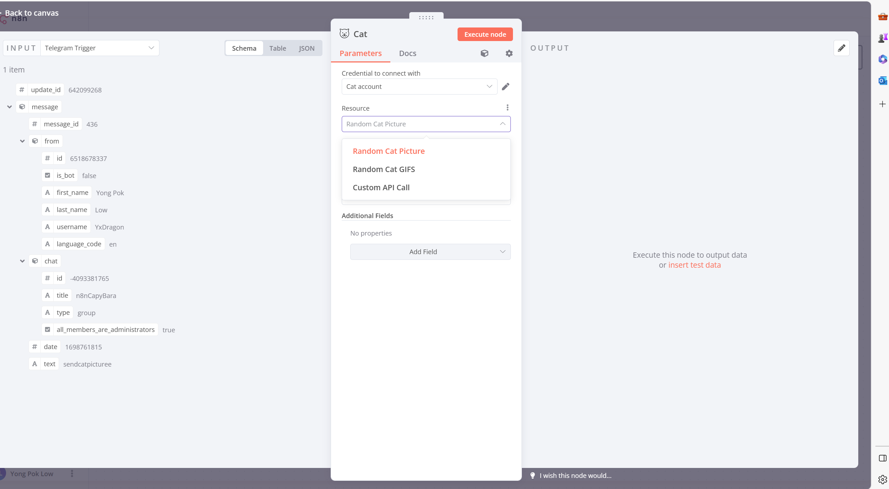
#### *Bij Yes*
Bij 'Yes' krijg je niet alleen een foto maar ook een hele beschrijving en dingen zoals naam, verwachte leeftijd en oorsprong.

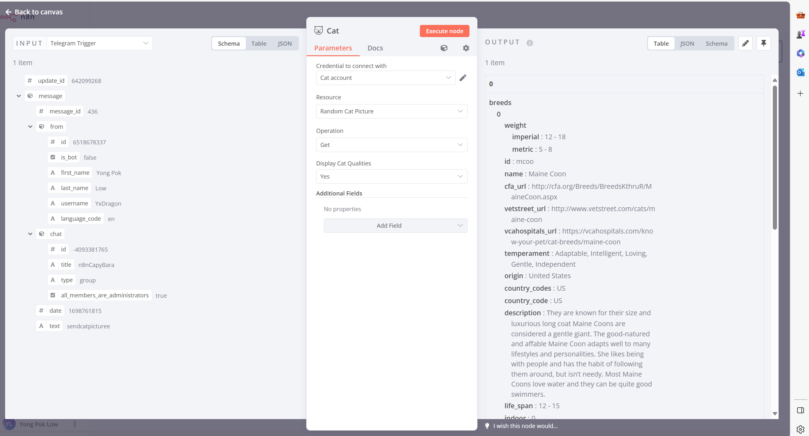
#### *Bij No*
Bij 'No' krijg je alleen een leuke kattenfoto.      
De Breeds array is empty maar daar hoef je niet op te letten.. het is alleen meer werk als je JSON moet oproepen met [0] omdat het een Json Object is.

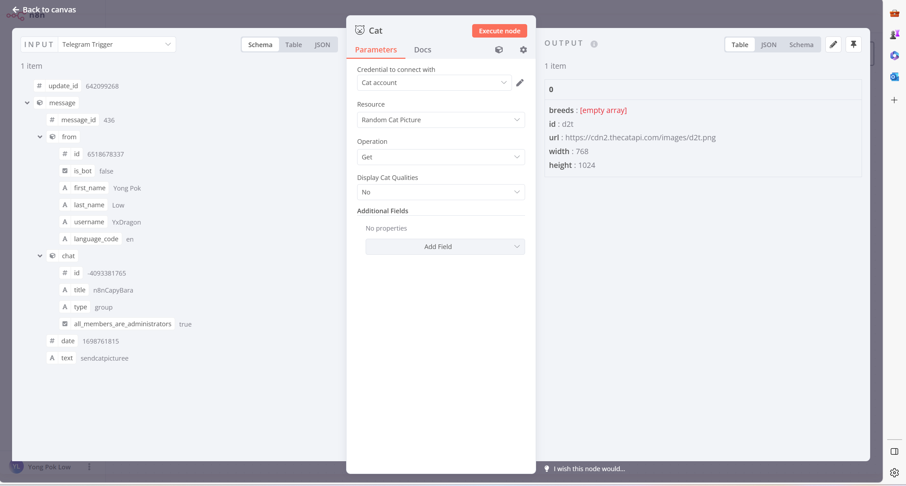
#### *Bij Random Cat Gifs* 
Random Cat GIFS heeft alleen een standaard operation van 'Get'.     
Random Cat GIFS geeft de user de mogelijkheid om katten GIFS te sturen in plaats van alleen foto's. 

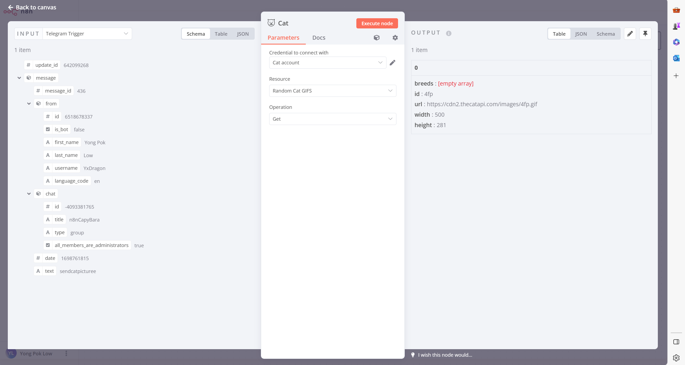

# **Tests**
Jaa we zijn er bij de Tests. Om de Cat Node te testen kunnen we gebruik maken van de standaard 'Cat_Workflow.Json' die je al kan vinden in de Github Repository hier.

## Importeer de Workflow.Json
Download de Cat.Workflow.Json van de Github hier en ga vervolgens terug naar je Workflow.
Helemaal rechtsbovenaan zie je drie stippeltjes. Klik erop en kies 'Import from File'

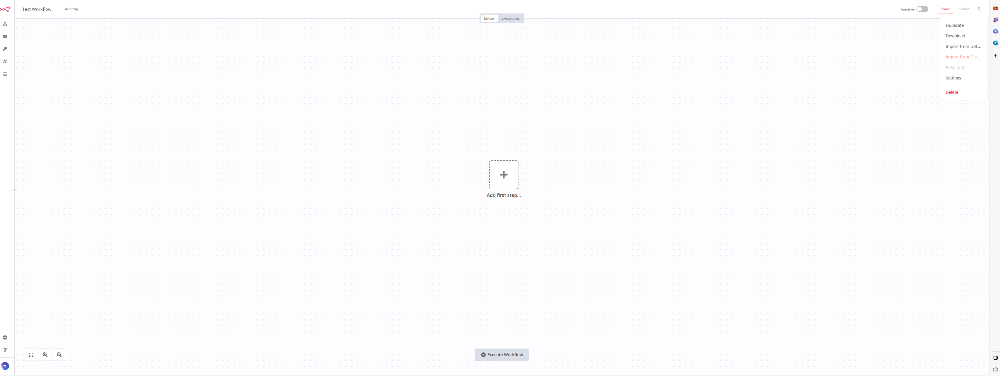

## Test Workflow
Als het goed is ziet het er zo uit.

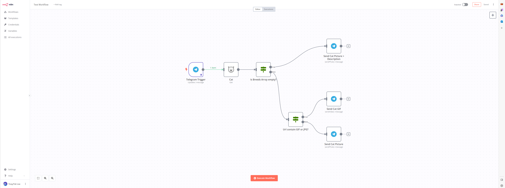

Druk op de grijze balk rechtsbovenaan om de workflow te activeren. Dit moeten we doen anders kunnen we geen data halen uit Telegram.
Normaliter moet je ook eerst je eigen Telegram account hebben met een BOT access token en die invullen als credentials voor Telegram. Zo kan die namelijk jou en jouw chat ID vinden.
In onze voorbeeld heb ik er al 1.
Als er gedrukt wordt op 'Listen for an event' en ik een message intypt in de Chat Group ontvangt de Telegram Trigger gegevens over mij zoals naam, id en in welke chat id ik zit. Dit hebben we nodig.
Dit gepinde informatie staat trouwens in de Cat_Workflow.Json..

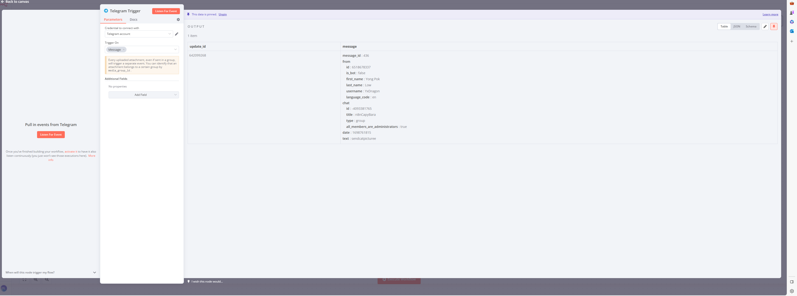

### Tijd om de Cat Node te testen
## Cat Gifs
Klik op de Cat Node en je kan zien dat je kan kiezen tussen 2 Resources. Cat Gifs en Cat Pictures. We kiezen als voorbeeld eerst 'Cat Gifs' en execute de Cat Node.

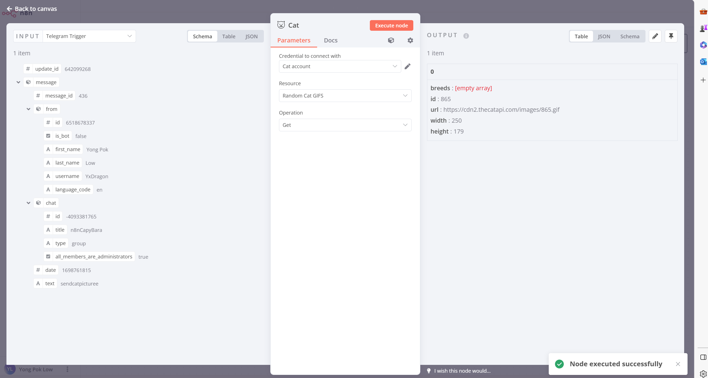

In de output kan je zien dat er in de url een gif uitkomt. We gaan eventjes terug naar de Workflow zelf en dan drukken we op 'Execute Workflow'.

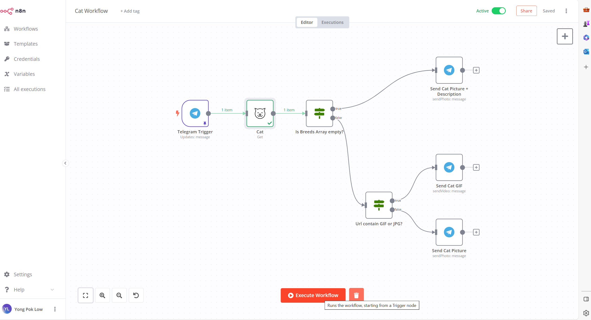

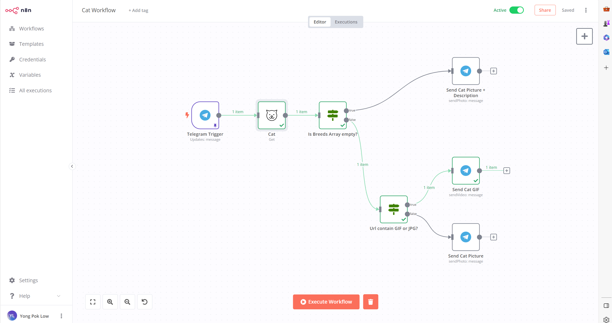

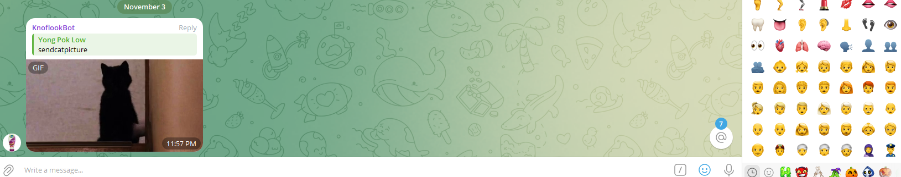

Top het werkt! Het reageert standaard op alle berichten dus hoeft niet alleen op 'sendcatpicture' of iets.. maar de optie is er wel in de n8n workflow om dat te filteren gebaseerd op de tekst die gegeven wordt in Telegram. Dat kan je bereiken met IF en SWITCH nodes.

## Cat Pictures 
We gaan nu kijken naar de 'Cat Pictures'. We veranderen de Resource naar 'Random Cat Picture' en kiezen bij Display Cat Qualities de keuze 'No' we willen alleen de foto!

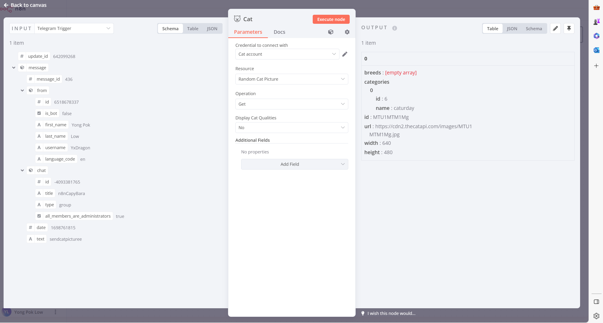

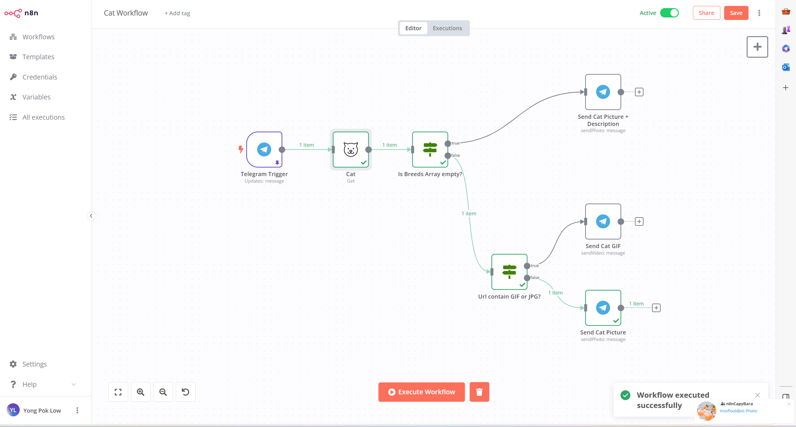

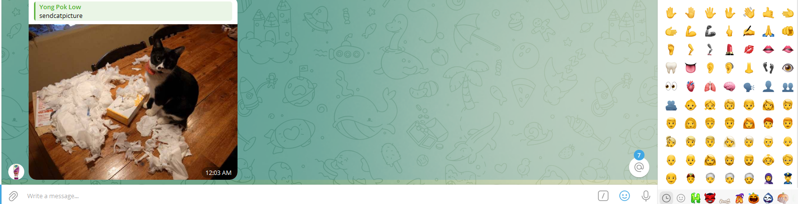

Toppie het gaat de juiste route op.

## Cat Pictures met Description

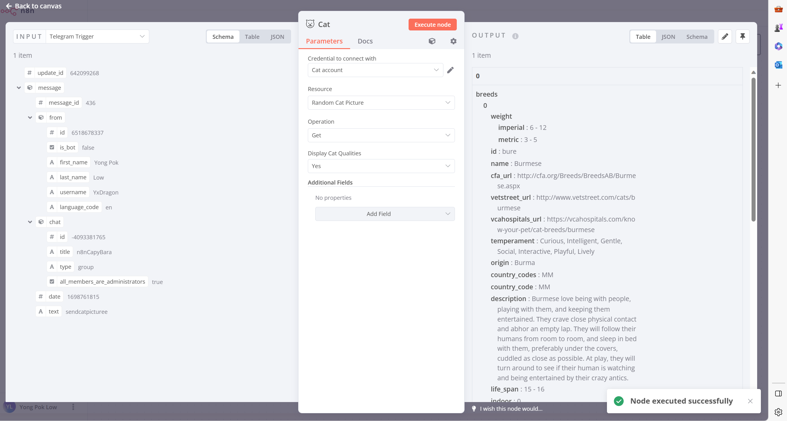

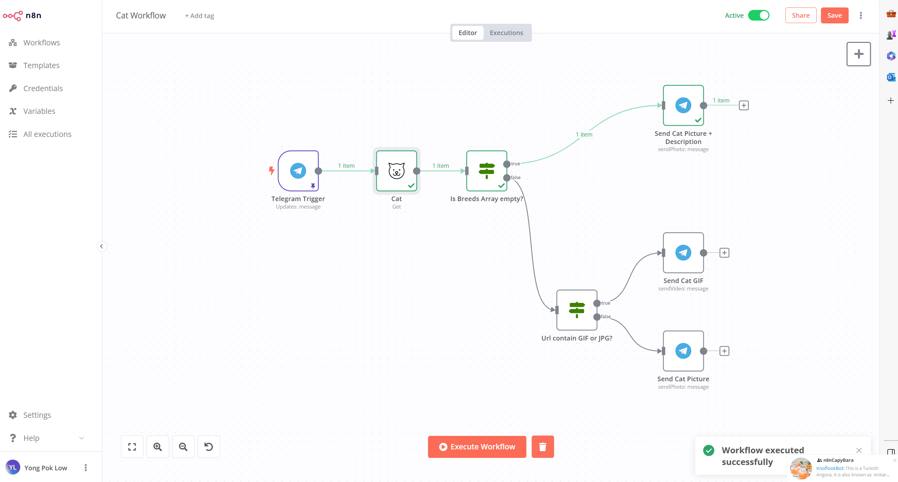


Hier heb je dan een kattenfoto met naam, beschrijving, leeftijdverwachting en oorsprong!

# Hoe werkt de logica in onze Workflow?
In de Cat API krijgen we 'Empty Arrays' terug bij de foto's en gifs. Maar bij de foto's met descriptie is die *niet* leeg. We zetten dus een if condition dat als de array niet empty is dat het naar de bovenste route gaat.

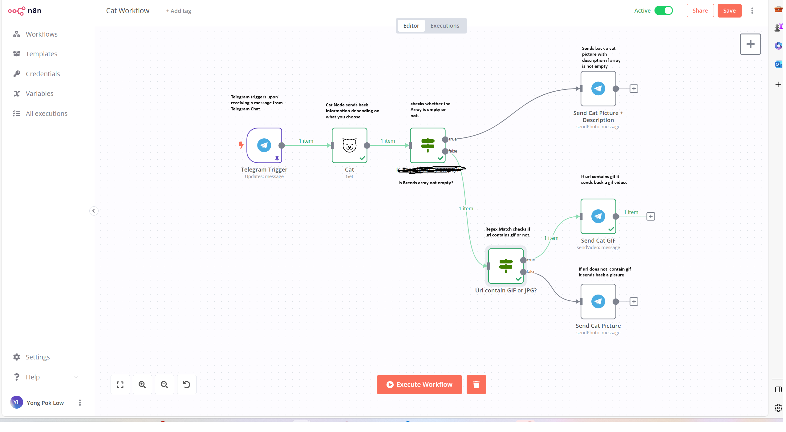

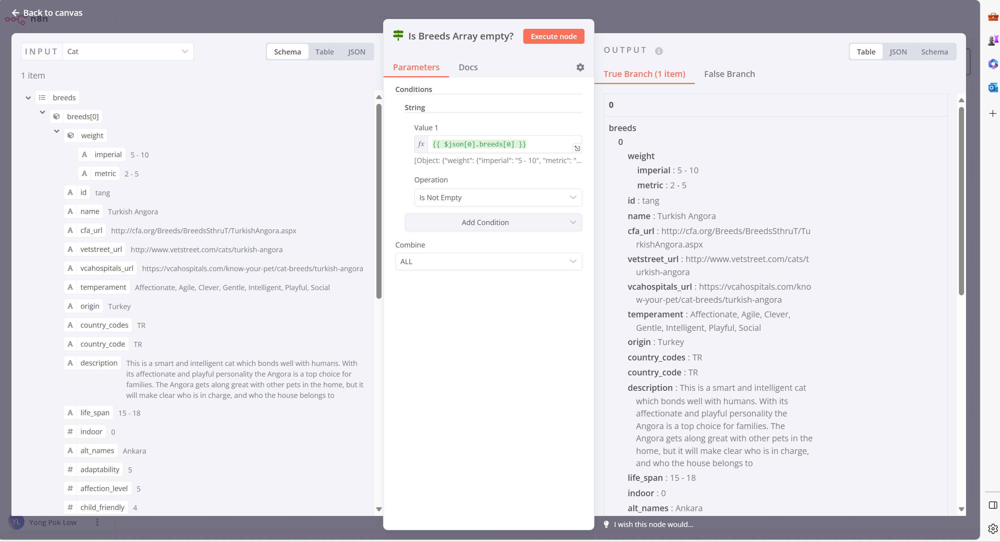

Als de Array empty is gaat het naar een nieuwe IF node waar we een Regex match neerzetten om te kijken of het een gif is of niet.
Als het wel GIF in de url bevat gaat het naar de middenste route. Anders gaat het naar de onderste route.

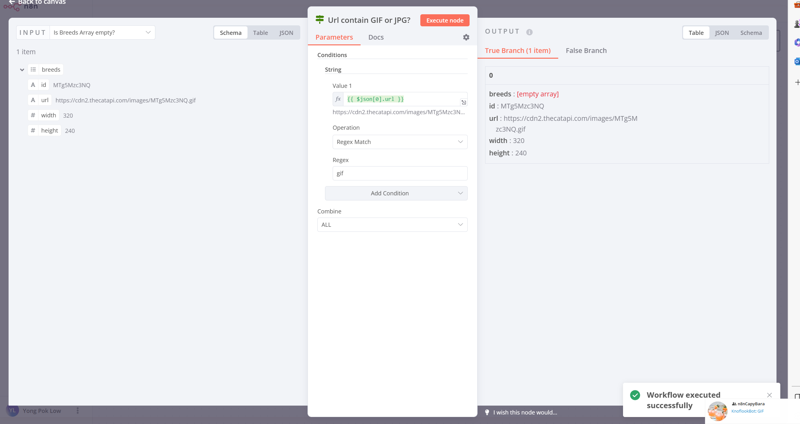

